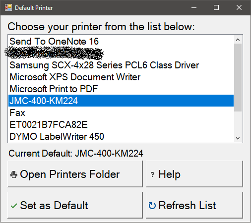

# Default Printer

&copy; 2017 by Luke Barone. Licensed under MIT License (see end)

## 1. Introduction

I wrote this program for new systems running Windows 10, and having many
printers installed. I am hoping that it is an easier way to choose your default
printer, as opposed to the new PC Settings method, or letting Windows 10 choose
for you. This has been known to be buggy in certain instances. If this is not
the easy way of choosing a default printer, then I feel this has failed.

This program is meant to be shared and distributed following the license below.
We have tested this program for inclusion with images (such as those craeted
with [FOG Project](https://github.com/FOGProject/FOGProject)) and for deploying
to systems (i.e. with Group Policy or PDQ Deploy).

Since default printer choices are per-user, this app **does not require Admin
rights to run**. No installer required, you can drop the program anywhere the
user(s) have access to and let it run, including on file servers or USB drives.

## 2. How to Compile

Using Visual Studio 2017. Open the `ChooseDefaultPrinter.sln` file, and compile
from there. It should create the binary in the
`ChooseDefaultPrinter1/bin/{ Debug | Release }/` directory.

## 3. How to use the program (README for the app)

With the main window open, it should list all the printers installed for your
system. To refresh the list of printers (and the Default Printer), click on the
[Refresh List] button.

Choose the printer from the list to be your new default, and use the
[Set as Default] button. To verify that the change has been made, click on the
[Refresh Printers] button.

You can use the [Open Printers Folder] button to open the old-style (Pre-Vista)
Printers folder, that lists each printer queue as its own separate printer.

If there is an error applying the setting, the program should self-recover
without an error being shown. If you see an error, please submit a bug report.

## LICENSE

MIT License

Copyright (c) 2017 Luke Barone

Permission is hereby granted, free of charge, to any person obtaining a copy of
this software and associated documentation files (the "Software"), to deal in
the Software without restriction, including without limitation the rights to
use, copy, modify, merge, publish, distribute, sublicense, and/or sell copies
of the Software, and to permit persons to whom the Software is furnished to do
so, subject to the following conditions:

The above copyright notice and this permission notice shall be included in all
copies or substantial portions of the Software.

THE SOFTWARE IS PROVIDED "AS IS", WITHOUT WARRANTY OF ANY KIND, EXPRESS OR
IMPLIED, INCLUDING BUT NOT LIMITED TO THE WARRANTIES OF MERCHANTABILITY,
FITNESS FOR A PARTICULAR PURPOSE AND NONINFRINGEMENT. IN NO EVENT SHALL THE
AUTHORS OR COPYRIGHT HOLDERS BE LIABLE FOR ANY CLAIM, DAMAGES OR OTHER
LIABILITY, WHETHER IN AN ACTION OF CONTRACT, TORT OR OTHERWISE, ARISING FROM,
OUT OF OR IN CONNECTION WITH THE SOFTWARE OR THE USE OR OTHER DEALINGS IN THE
SOFTWARE.
